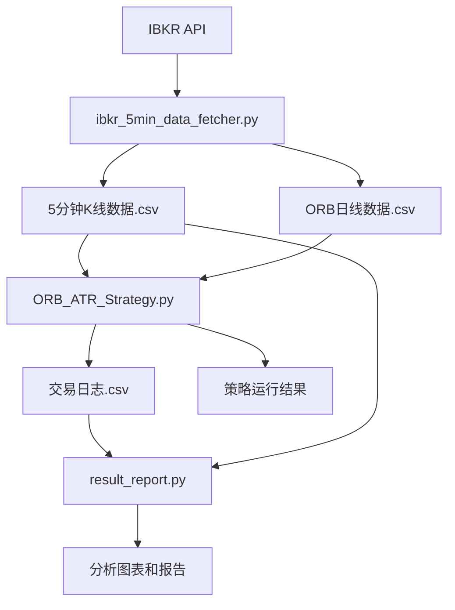

# ORB-Strategy 项目

基于 Opening Range Breakout (ORB) 策略的自动化交易系统，支持 ATR 动态止损和详细的交易日志记录。

## 📁 项目结构

```
ORB-Strategy/
├── README.md                    # 项目说明文档
├── config.py                    # 配置文件
├── market_calendar.py           # 市场日历模块
├── ibkr_5min_data_fetcher.py   # IBKR数据获取器
├── ORB_ATR_Strategy.py         # ORB+ATR策略 (推荐使用)
├── ORB_Strategy.py             # 基础ORB策略
├── result_report.py            # 分析报告生成器
├── data/                       # 数据存储目录
│   ├── TQQQ_5min_full_*.csv   # 5分钟K线数据
│   └── TQQQ_ORB_data_*.csv    # ORB日线数据
├── log/                        # 交易日志目录
│   └── TQQQ_trades_*.csv      # 详细交易记录
└── reports/                    # 分析报告目录
    ├── TQQQ_equity_comparison.png
    ├── TQQQ_pnl_distribution.png
    ├── TQQQ_trade_analysis.png
    └── TQQQ_analysis_report.txt
```

## 🚀 快速开始

### 1. 环境准备
```bash
# 安装依赖包
pip install ib-insync pandas numpy matplotlib pytz

# 确保TWS或IB Gateway已启动并开放API权限
```

### 2. 配置参数
编辑 `config.py` 文件，设置：
- 交易品种 (`SYMBOLS`)
- 日期范围 (`START_DATE`, `END_DATE`)
- 初始资金 (`INITIAL_CAPITAL`)
- 风险参数 (`RISK_PER_TRADE`, `MAX_LEVERAGE`)

### 3. 数据获取（首次运行）
```bash
# 从IBKR获取历史数据
python ibkr_5min_data_fetcher.py
```

### 4. 运行策略```bash# 运行ORB+ATR策略（推荐）python ORB_ATR_Strategy.py# 或运行基础ORB策略python ORB_Strategy.py```### 5. 生成分析报告```bash# 分析交易结果并生成图表报告python result_report.py```

## 📈 交易策略详解

### 策略一：ORB + ATR 动态止损策略

#### 核心逻辑
1. **开盘区间识别**：取当日开盘后前两根5分钟K线
2. **方向确认**：根据第一根K线的开收盘价确定趋势方向
   - 收盘价 > 开盘价 → 做多
   - 收盘价 < 开盘价 → 做空
3. **入场时机**：第二根5分钟K线开盘价入场
4. **动态止损**：使用ATR(14)计算止损距离
   - 止损距离 = ATR × 0.05（可配置）
   - 做多止损 = 入场价 - ATR止损距离
   - 做空止损 = 入场价 + ATR止损距离
5. **出场机制**：
   - 触及ATR止损 → 止损出场
   - 当日收盘前未触及止损 → 收盘价出场

#### 仓位管理
```python
# 风险仓计算
风险仓 = (账户资金 × 风险比例) / 每股风险金额

# 杠杆仓计算  
杠杆仓 = (最大杠杆 × 账户资金) / 入场价格

# 实际仓位 = min(风险仓, 杠杆仓)
```

#### 优势特点
- ✅ ATR动态止损，适应市场波动
- ✅ 详细的风险仓和杠杆仓分析
- ✅ 完整的交易日志记录（CSV格式）
- ✅ 支持R倍数风险收益分析

### 策略二：基础 ORB 策略

#### 核心逻辑
1. **开盘区间识别**：前两根5分钟K线确定高低点
2. **突破入场**：价格突破开盘区间时入场
   - 突破上边界 → 做多
   - 突破下边界 → 做空
3. **固定止损**：对边界作为止损位
4. **出场机制**：
   - 触及止损 → 止损出场
   - 当日收盘 → 市价出场

## 📊 数据文件说明

### 5分钟K线数据格式
```csv
date,open,high,low,close,volume,tradeDate
2025-05-20 09:30:00-04:00,45.21,45.35,45.18,45.30,125000,2025-05-20
```

### 交易日志格式
```csv
交易日期,品种,方向,入场时间(ET),出场时间(ET),入场价格,出场价格,止损价格,股数,风险仓,杠杆仓,仓位价值,ATR,ATR止损距离,风险点数,风险金额,杠杆倍数,佣金,盈亏,盈亏比例,R倍数,出场原因,交易前资金,交易后资金,是否交易日
```

## ⚙️ 配置参数说明

### 基础配置
```python
# 交易品种
SYMBOLS = ['TQQQ', 'SQQQ']

# 日期范围
START_DATE = '2025-03-01'
END_DATE = '2025-05-23'

# 资金管理
INITIAL_CAPITAL = 100000       # 初始资金
RISK_PER_TRADE = 0.02         # 单笔风险2%
MAX_LEVERAGE = 4.0            # 最大杠杆4倍
```

### ATR参数
```python
# ATR动态止损
atr_period = 14               # ATR计算周期
atr_multiplier = 0.05         # ATR止损系数
```

## 📈 运行结果示例

```
===== 策略运行结果 =====
总交易次数: 45
盈利次数: 28
亏损次数: 17
胜率: 62.22%
总盈亏: $8,543.67
收益率: 8.54%
平均R倍数: 1.23R
策略运行完成
```

## 📊 分析报告功能

### 生成内容
- **权益曲线对比图**：策略 vs 买入持有(B&H)
- **盈亏分布分析**：直方图、R倍数分布、胜负比例
- **交易分析图表**：出场原因、方向分析、月度趋势
- **详细统计报告**：胜率、盈亏比、最大回撤等指标

### 输出文件```reports/├── {SYMBOL}_equity_comparison.png    # 权益曲线对比├── {SYMBOL}_pnl_distribution.png     # 盈亏分布图├── {SYMBOL}_trade_analysis.png       # 交易分析图└── {SYMBOL}_analysis_report.txt      # 详细分析报告```

## 🔍 数据流程



## ⚠️ 注意事项

1. **数据依赖**：首次运行必须先执行数据获取程序
2. **时区处理**：所有时间均转换为美东时间(ET)
3. **交易日筛选**：自动过滤非交易日，仅在交易日执行策略
4. **风险控制**：建议在模拟环境充分测试后再投入实盘
5. **佣金设置**：默认每股$0.005，可在config.py中调整

## 🛠️ 技术特性

- **市场日历**：自动识别美股交易日和节假日
- **时区转换**：支持UTC/EST/EDT自动转换
- **数据完整性**：扩展数据范围确保ATR指标完整计算
- **错误处理**：完善的异常处理和日志记录
- **CSV导出**：UTF-8 BOM编码，Excel友好显示

## 📞 支持

如有问题或建议，请提交Issue或联系开发团队。 